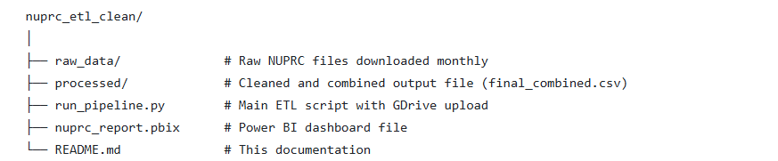
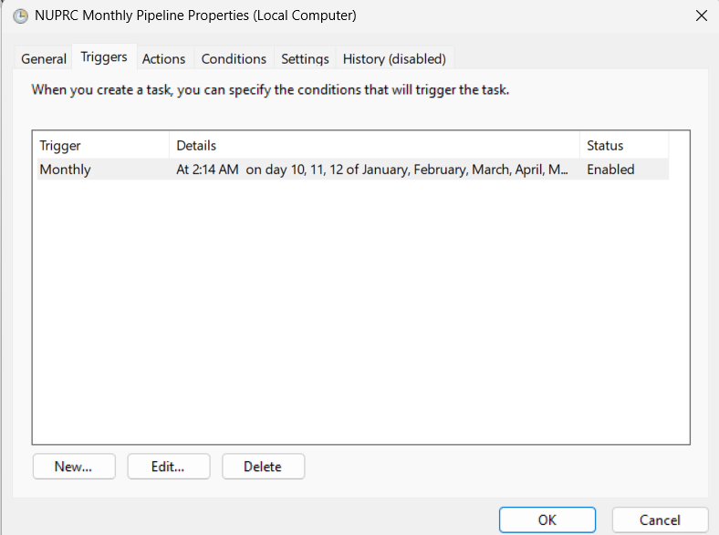
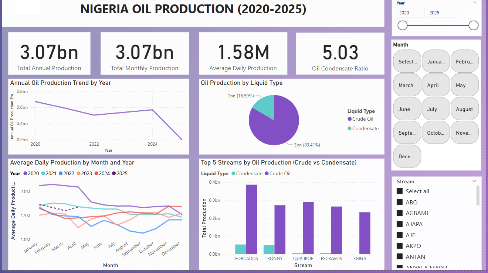
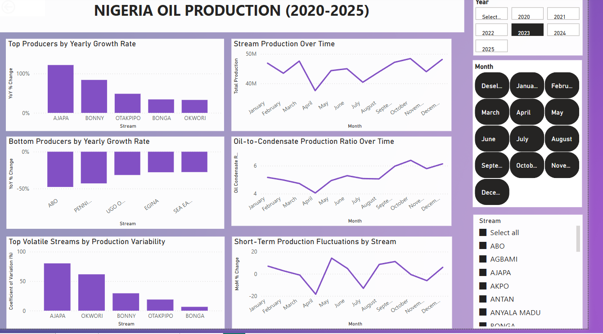

# 🛢️ NUPRC Oil Production ETL & Power BI Dashboard

This project automates the end-to-end ETL pipeline for Nigerian upstream oil production data, sourced from the [Nigerian Upstream Petroleum Regulatory Commission (NUPRC)](https://www.nuprc.gov.ng/), cleans it, and makes it available for business intelligence analysis in Power BI.

---

## 🚀 Project Overview

**Goal**: Automate extraction, transformation, and loading (ETL) of oil and condensate production reports, and enable monthly updates into a Power BI dashboard for visualization and analysis.

---

## 🔁 Workflow Summary

| Step        | Description |
|-------------|-------------|
| **Extract** | Scrapes all available `.xls`, `.xlsx`, `.csv` production files from the [NUPRC website](https://www.nuprc.gov.ng/oil-production-status-report/) |
| **Transform** | Cleans headers, unifies structure, melts monthly production data, and parses stream names, years, and months |
| **Load** | Uploads the cleaned, combined CSV file to a fixed Google Drive location |
| **Visualize** | Power BI connects to the Google Drive CSV for automated refresh and analytics |

---

## 📁 Folder Structure

---

## 📊 Power BI Dashboard Highlights

- 📈 **Trend Analysis**: Monthly oil vs condensate production volumes  
- 🔁 **Month-over-Month**: Uses *average daily production* to remove month-length bias  
- 🗃️ **Stream-level Insights**: Terminal/Stream performance over time  
- 🛢️ **Oil-Condensate Ratio**: Visualized to track blend variation  

---

## 🛠️ Tech Stack

- **Python**: `requests`, `pandas`, `bs4`, `google-api-python-client`
- **Google Drive API**: Authenticated upload of final CSV
- **Power BI**: Data transformation and dashboarding
- **Windows Task Scheduler**: For monthly automation

---

## 🧠 Automation Flow

1. `run_pipeline.py` is executed monthly (via Task Scheduler)

2. New files are downloaded and cleaned

3. A single CSV is generated and **overwritten** on Google Drive
4. Power BI reads the Google Drive CSV and updates visuals

---

## ✅ Data Validation

Robust validation steps were implemented before saving or uploading the final dataset:

- **Missing Values Check**: Ensures no nulls in critical columns like `Year`, `Month`, `Stream`, `Liquid Type`, and `Production`.
- **Negative Value Filter**: Removes any rows where `Production` is less than 0.
- **Month Validation**: Ensures all month entries belong to the expected 12 calendar months.
- **Duplicate Records**: Flags and removes duplicate entries based on `Year`, `Month`, `Stream`, and `Liquid Type`.

These checks help maintain **data quality**, avoid errors in downstream Power BI reports, and ensure consistent data structure for analysis and automation.

---

## 📊 Dashboard Analysis

This project includes two pages in Power BI for analyzing Nigerian oil production from 2020–2025.

---

### 📄 Page 1: Nigeria Oil Production Overview

This page provides a high-level summary of total oil and condensate production, volume trends, and stream performance.

#### 🔍 Key Highlights

- **Total Production (2020–2025)**:  
  Over **3.07 billion barrels** produced across the period.

- **Average Daily Production**:  
  Averaged **1.58 million barrels/day**, with slight declines between 2020–2022, and a partial-year drop in 2025.

- **Oil vs Condensate Composition**:  
  Crude oil dominated with over **83% share**, maintaining a 5:1 oil-to-condensate ratio.

- **Top Performing Streams**:  
  Streams like **FORCADOS**, **BONNY**, and **QUA IBOE** consistently led in total volume.

- **Monthly Seasonality**:  
  A visual breakdown showed dips in April–June 2021 and August–October 2022, indicating seasonal or operational effects.

- **Slicer-enabled Filters**:  
  Users can filter by year, month, and stream to isolate patterns.

---

### 📄 Page 2: Performance & Opportunity Analysis

This page focuses on performance metrics such as yearly growth, volatility, and short-term trends to surface actionable insights.

#### 📈 Views Included

| Visual | Purpose |
|--------|---------|
| **Top Producers by YoY Growth** | Streams with highest year-over-year increase |
| **Bottom Producers by YoY Decline** | Streams with largest drops from previous year |
| **Volatility (Coefficient of Variation)** | Measures stream stability over time |
| **MoM % Change** | Monthly short-term production changes |
| **Oil-to-Condensate Ratio Over Time** | Trend in blend composition |

#### 🧪 Sample Insight (2023)

From the 2023 dashboard:

- ✅ **AJAPA** showed over **100% YoY growth**, signaling recovery.
- 📉 **ABO** and **PENNINGTON** declined **~50%**, requiring operational review.
- 🔁 **AJAPA** and **OKWORI** had the **highest variability**, flagging potential instability.
- 📊 **BONGA** and **OTAKPIPO** combined strong growth with low variability — ideal for replication.
- ⚖️ The oil-to-condensate ratio shifted mid-year, indicating temporary changes in blend strategy.

---

### 💼 Use Cases for Stakeholders

- 📍 Identify scalable streams and allocate resources accordingly
- 🚩 Detect streams in decline for further investigation
- 🔁 Compare stream variability to prioritize maintenance
- 📊 Report high-level insights to management using filters and visuals

---

## 🔐 Security

> 🔒 Sensitive files such as `credentials.json` and `token.json` were excluded from GitHub using `.gitignore` to prevent credential leaks.

---

## 🧪 Future Improvements

- Add email notifications after successful pipeline runs
- Integrate with Google Sheets or BigQuery for advanced querying
- Deploy on a cloud-based scheduler (e.g., GitHub Actions or Google Cloud Functions)

---

## 🙋‍♂️ Author

**Olatomi Adigun**  
[GitHub Profile](https://github.com/OlatomiAdigun)  
Calgary, Alberta | Data Engineer | [LinkedIn](https://www.linkedin.com/in/olatomiadigun)

---

## 📝 License

This project is for educational and demonstration purposes only.

